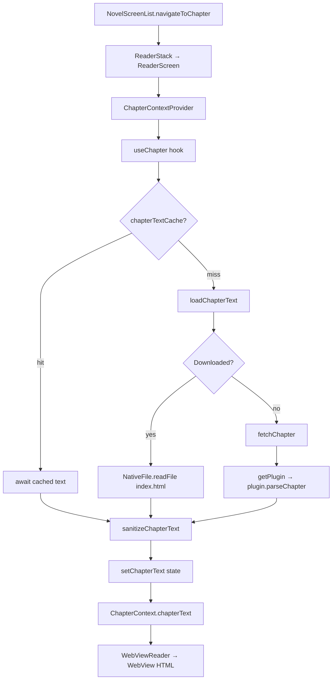

# LNReader — Reader Architecture Map

Architecture reference for the chapter text pipeline: from plugin/extension fetch through React Native state to WebView render. Intended for AI agents and contributors building reader features.

---

## 1. Main Reader UI (where text is rendered)

Chapter text is **not** rendered with native React Native `<Text>` components. It is injected as HTML into a **WebView**.

| Layer | File | Component | Role |
|---|---|---|---|
| Screen shell | `src/screens/reader/ReaderScreen.tsx` | `Chapter` → `ChapterContent` | Layout, loading/error states, mounts reader |
| **Render target** | `src/screens/reader/components/WebViewReader.tsx` | `WebViewReader` | Injects `chapterText` HTML into the WebView |
| In-WebView JS | `android/app/src/main/assets/js/core.js` | `window.reader` | Scroll, TTS, page-reader; reads `#LNReader-chapter` |

### Actual HTML injection point

```tsx
// src/screens/reader/components/WebViewReader.tsx (lines 505–507)
<div id="LNReader-chapter">
  ${html}
</div>
```

- `html` is aliased from context as `chapterText` (line 70).
- The WebView JS binds to that DOM node on load:

```js
// android/app/src/main/assets/js/core.js (lines 22–32)
this.chapterElement = document.querySelector('#LNReader-chapter');
this.rawHTML = this.chapterElement.innerHTML;
```

### Loading gate

`ReaderScreen` only mounts `WebViewReader` after loading finishes:

```tsx
// src/screens/reader/ReaderScreen.tsx (lines 128–132)
{loading ? (
  <ChapterLoadingScreen />
) : (
  <WebViewReader onPress={hideHeader} />
)}
```

### Navigation entry

- Stack: `src/navigators/ReaderStack.tsx` — `Chapter` screen maps to `ReaderScreen`.
- Wrapped in `NovelContextProvider` for novel-level state.

---

## 2. Data flow (plugin → UI)



### Step-by-step

#### Entry (navigation)

`src/screens/novel/components/NovelScreenList.tsx` — `navigateToChapter` (lines 158–166):

```tsx
navigation.navigate('ReaderStack', {
  screen: 'Chapter',
  params: { novel, chapter },
});
```

#### Context + hook

`src/screens/reader/ChapterContext.tsx`:

- Calls `useChapter(webViewRef, initialChapter, novel)` (line 25).
- Exposes return value (including `chapterText`) via React Context (lines 27–34).

#### Fetch / load — `src/screens/reader/hooks/useChapter.ts`

1. `useEffect` (lines 333–337) calls `getChapter()` on mount.
2. `getChapter()` (lines 125–230) checks `chapterTextCache.read(chap.id)`.
3. On cache miss, `loadChapterText()` (lines 107–123):
   - **Offline:** reads `{NOVEL_STORAGE}/{pluginId}/{novelId}/{id}/index.html`
   - **Online:** calls `fetchChapter(novel.pluginId, path)`
4. Adjacent chapters are pre-fetched into cache (lines 193–198).
5. Raw text passes through `sanitizeChapterText()` then `setChapterText()` (lines 203–210).

#### Plugin layer — `src/services/plugin/fetch.ts`

```ts
// lines 13–19
export const fetchChapter = async (pluginId: string, chapterPath: string) => {
  const plugin = getPlugin(pluginId);
  let chapterText = `Unknown plugin: ${pluginId}`;
  if (plugin) {
    chapterText = await plugin.parseChapter(chapterPath);
  }
  return chapterText;
};
```

- `getPlugin()` — `src/plugins/pluginManager.ts` (lines 161–177): loads extension JS from `{PLUGIN_STORAGE}/{pluginId}/index.js`.
- Plugin contract — `src/plugins/types/index.ts` (line 125): `parseChapter(chapterPath: string): Promise<string>` returns raw HTML.
- Downloads use the same plugin path: `src/services/download/downloadChapter.ts` (line 89) → writes sanitized HTML to disk as `index.html`.

#### Sanitization — `src/screens/reader/utils/sanitizeChapterText.ts`

- Lines 4–79: `sanitizeHtml()` with an allowlist of tags/attributes.
- Returns a fallback empty-chapter message if sanitization yields nothing.

#### In-memory cache

- `chapterTextCache` lives in the novel store (`src/hooks/persisted/useNovel/store/`).
- API: `read(chapterId)`, `write(chapterId, text)`, `remove`, `clear`.
- Used in `useChapter.getChapter()` to avoid re-fetching during navigation.

#### Render

`WebViewReader` reads `chapterText` from `useChapterContext()` and embeds it in the WebView `source.html` template (line 506).

---

## 3. Key files and line numbers

| Concern | File | Lines |
|---|---|---|
| Navigation into reader | `src/screens/novel/components/NovelScreenList.tsx` | 158–166 |
| Reader stack / screen registration | `src/navigators/ReaderStack.tsx` | 34 |
| Screen orchestration | `src/screens/reader/ReaderScreen.tsx` | 62–132 |
| **Text state owner** | `src/screens/reader/hooks/useChapter.ts` | 56, 107–123, 125–230, 203–210, 353 |
| Context bridge | `src/screens/reader/ChapterContext.tsx` | 25–34, 43–45 |
| **HTML render** | `src/screens/reader/components/WebViewReader.tsx` | 70, 446–547, 505–507 |
| Plugin fetch API | `src/services/plugin/fetch.ts` | 13–19 |
| Plugin loader | `src/plugins/pluginManager.ts` | 42–85, 161–177 |
| Plugin type (`parseChapter`) | `src/plugins/types/index.ts` | 125 |
| HTML sanitization | `src/screens/reader/utils/sanitizeChapterText.ts` | 4–79 |
| Chapter download (offline path) | `src/services/download/downloadChapter.ts` | 89–60 |
| In-WebView reader behavior | `android/app/src/main/assets/js/core.js` | 22–32 |
| Loading placeholder UI | `src/screens/reader/ChapterLoadingScreen/ChapterLoadingScreen.tsx` | — |

---

## 4. Injection points for custom hooks / wrappers

Ordered by how cleanly they sit **before render** and how little they disturb surrounding code.

### Recommended: `useChapter.ts` — after fetch, before `setChapterText` (lines 203–209)

Single choke point for all text sources (plugin fetch, disk, cache). Every path passes through `sanitizeChapterText` here.

```ts
// useChapter.ts ~203
const processed = useYourTransformHook(
  sanitizeChapterText(novel.pluginId, novel.name, chap.name, awaitedText),
);
setChapterText(processed);
```

Or extract a `useProcessedChapterText(rawText, meta)` helper called inside `getChapter`.

### Good: `ChapterContext.tsx` (lines 25–34)

Wrap `useChapter` output and transform `chapterText` before putting it in context — keeps `useChapter` untouched:

```ts
const chapterHookContent = useChapter(webViewRef, initialChapter, novel);
const transformedText = useChapterTextInterceptor(
  chapterHookContent.chapterText,
  novel,
  chapterHookContent.chapter,
);
const contextValue = useMemo(
  () => ({
    novel,
    webViewRef,
    ...chapterHookContent,
    chapterText: transformedText,
  }),
  [novel, webViewRef, chapterHookContent, transformedText],
);
```

### Good: `sanitizeChapterText.ts` (lines 4–79)

Centralizes HTML cleanup. Best for sanitization/filtering; less ideal for stateful hooks (annotations, per-user overlays, etc.).

### Lower-level (raw HTML, pre-sanitize)

| Location | File | Lines | Use when |
|---|---|---|---|
| `loadChapterText` | `useChapter.ts` | 107–123 | Transform before sanitization; affects disk vs network equally |
| `fetchChapter` | `src/services/plugin/fetch.ts` | 13–19 | Transform all plugin output app-wide |

### Render-time only (last resort): `WebViewReader.tsx` (lines 70, 506)

```ts
const { chapterText: html, ... } = useChapterContext();
const displayHtml = useYourTransform(html);
// use displayHtml in template at line 506
```

Works, but runs on every WebView re-render and bypasses the data layer. Prefer the hook/context layer unless the transform is purely presentational.

---

## 5. Related reader files (not on the text pipeline)

These affect reader UX but do not own chapter text state:

| File | Purpose |
|---|---|
| `src/screens/reader/components/ReaderAppbar.tsx` | Top bar |
| `src/screens/reader/components/ReaderFooter.tsx` | Bottom nav, chapter prev/next |
| `src/screens/reader/components/ReaderBottomSheet/` | Theme, font, TTS settings |
| `src/screens/reader/components/ChapterDrawer/` | Chapter list drawer |
| `src/screens/settings/SettingsReaderScreen/` | Global reader settings |
| `src/utils/constants/readerConstants.ts` | Reader constants |

---

## 6. Tests to consult

| File | Covers |
|---|---|
| `src/screens/reader/hooks/__tests__/useChapter.test.ts` | Cache, DB hydration, fetch paths |
| `src/screens/reader/components/ChapterDrawer/__tests__/ChapterDrawer.test.tsx` | Chapter drawer UI |

When adding a text interceptor hook, extend `useChapter.test.ts` or add a dedicated test file alongside your hook.

---

## 7. Summary for AI agents

- **Component that renders chapter text:** `WebViewReader` (`src/screens/reader/components/WebViewReader.tsx`).
- **State that holds chapter text:** `chapterText` in `useChapter` (`src/screens/reader/hooks/useChapter.ts`), exposed via `ChapterContext`.
- **Plugin fetch:** `fetchChapter` → `plugin.parseChapter` (`src/services/plugin/fetch.ts`, `src/plugins/pluginManager.ts`).
- **Best hook injection site:** `useChapter.ts` lines **203–209** (after `sanitizeChapterText`, before `setChapterText`), or compose in `ChapterContext.tsx` lines **25–34**.
